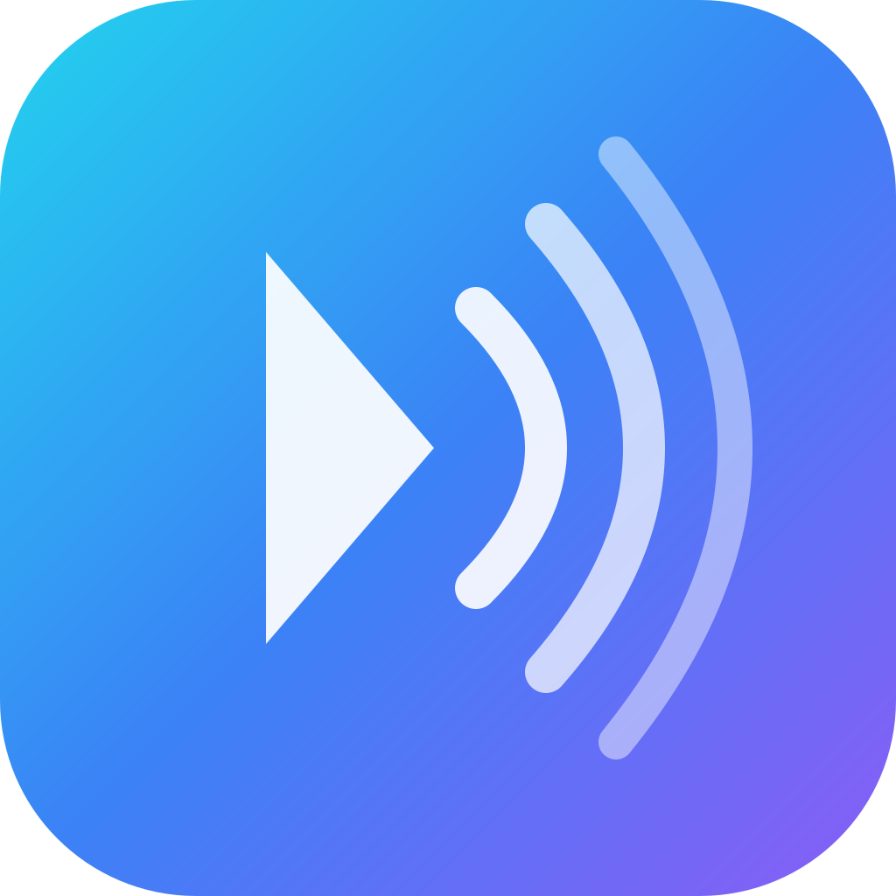

  

<h1 align="center">Soranaflow</h1>

  <b>Professional Hi-Fi Audio Player for macOS</b> 
  Bit-perfect playback · DSD native · Advanced DSP · Apple Music integration

  
  
  
  
  

---

## Tech Stack

| Component | Technology |
|-----------|-----------|
| Framework | Qt 6 / C++17 |
| Audio | CoreAudio, FFmpeg, soxr |
| DSP | Custom pipeline, VST3 SDK, Audio Units |
| Metadata | TagLib, MusicBrainz, AcoustID, chromaprint |
| Streaming | Native MusicKit (Apple Music), Synology FileStation, DLNA/UPnP |
| Spatial | libmysofa (HRTF) |
| Updates | Sparkle framework |
| Build | CMake, Apple Silicon native (arm64) |

## Features

**Playback Engine**
- Bit-perfect playback via CoreAudio exclusive mode
- DSD native support (DoP / Native)
- Gapless playback with sample-accurate transitions
- Support for FLAC, ALAC, WAV, AIFF, DSD (DSF/DFF), MP3, AAC, OGG

**DSP Processing**
- 20-band parametric EQ with real-time frequency analyzer
- VST3 and Audio Unit plugin hosting with native editor UI
- Convolution engine for room correction (IR loading)
- HRTF binaural processing (libmysofa)
- Headroom management & limiter
- Full signal path visualization

**Library Management**
- Smart library scanning with metadata extraction
- Folder browser with tree-based navigation
- Album art discovery (folder + embedded)
- MusicBrainz / AcoustID integration for metadata lookup
- Library rollback — one-click restore after rescan
- Synced lyrics support (embedded + LRCLIB)

**Streaming & NAS**
- Apple Music integration via Native MusicKit
- Synology NAS browsing via FileStation API
- DLNA/UPnP media server discovery

## Links

- [Website](https://soranaflow.com)
- [Downloads](https://soranaflow.com/downloads)
- [Changelog](https://soranaflow.com/changelog)
- [Report Issue](https://soranaflow.com/support)
- [Privacy Policy](https://soranaflow.com/privacy)

## Contributors

<table>
  <tr>
    <td align="center">
      <a href="https://github.com/ruki7423">
         
        <b>ruki7423</b>
      </a> 
      Lead Developer
    </td>
    <td align="center">
      <a href="https://claude.ai">
         
        <b>Claude</b>
      </a> 
      AI Pair Programmer
    </td>
  </tr>
</table>

## Support

If you find Soranaflow useful, you can support development at [ko-fi.com/ruki7423](https://ko-fi.com/ruki7423).

## Installation

**Download** the latest version from [soranaflow.com/downloads](https://soranaflow.com/downloads) or browse [all releases](https://github.com/ruki7423/Soranaflow/releases).

Drag **Soranaflow** to your Applications folder. The app is signed and notarized.

**Requirements:**
- macOS 14.0 (Sonoma) or later
- Apple Silicon (M1 / M2 / M3 / M4)

## What's New (v1.11.1)

Fixed signal path display issues where macOS AudioToolbox decoders caused incorrect codec classification.

- Lossless codecs (ALAC, FLAC) now correctly show "Lossless Decode" instead of "Lossy Decode"
- Overall signal path quality no longer shows "Unknown" for lossless playback chains
- True-Peak Lookahead limiter now displays latency in milliseconds
- Auto sample rate correctly identifies lossy formats through AudioToolbox decoder variants

See the full changelog at [soranaflow.com/changelog](https://soranaflow.com/changelog).

## License

**Proprietary** — Source code is viewable for reference only.
No permission to use, copy, modify, or distribute.
See [LICENSE](LICENSE) for full terms.

Official binaries available at [soranaflow.com](https://soranaflow.com/downloads).

---

  Made with care for audiophiles

